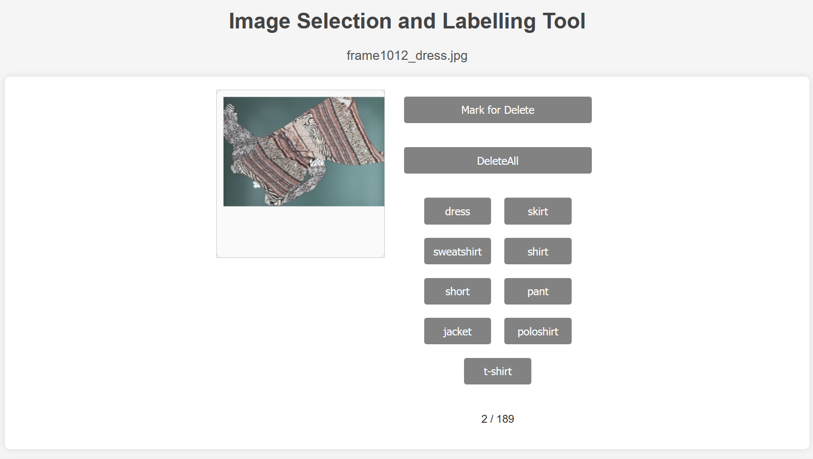

# Master Project Documentation

## Overview

This project focuses on textile classification using deep learning models. It leverages a data pipeline for preprocessing, model training, and evaluation using various Python libraries and frameworks like PyTorch, MongoDB, and YOLO.


## Table of Contents

- [Master Project Documentation](#master-project-documentation)
  - [Overview](#overview)
  - [Table of Contents](#table-of-contents)
  - [1. Repository Abstract Structure](#1-repository-abstract-structure)
  - [1. Repository Abstract Structure](#1-repository-abstract-structure-1)
  - [2. Environment Setup](#2-environment-setup)
    - [Prerequisites:](#prerequisites)
    - [Dataset Download:](#dataset-download)
    - [Installation:](#installation)
  - [3. Configuration](#3-configuration)
- [4. Data Pipeline](#4-data-pipeline)
  - [4.1 Pre-Annotation Pipeline](#41-pre-annotation-pipeline)
  - [4.2 Production Pipeline](#42-production-pipeline)
  - [4.3 Data Flow](#43-data-flow)
  - [4.4 Data Storage](#44-data-storage)
  - [4.5 Sample Workflow](#45-sample-workflow)
  - [6. Jupyter Notebooks](#6-jupyter-notebooks)
    - [Preprocessing:](#preprocessing)
    - [PyTorch:](#pytorch)
  - [7. Node.js Backend](#7-nodejs-backend)
    - [Running the Server:](#running-the-server)
      - [Example Usage](#example-usage)
  - [8. Source Code Breakdown](#8-source-code-breakdown)
    - [8.1 Pipeline](#81-pipeline)
  - [Modules](#modules)
  - [Helper](#helper)
  - [Utils](#utils)
  - [Plots](#plots)

---

## 1. Repository Abstract Structure


---

## 1. Repository Abstract Structure

```

.vscode/

config/

dataset/
    └── detex_2_0
    └── generator
    └── masks
    └── production_mockup
    └── production
    └── rotation


docs/

node/
    └── mongo/
    └── public/
    └── route/

notebooks/

    └── preprocessing/

    └── pytorch/

src/

    └── pipeline/

            └── modules/ 
                          └── helper/ 

    └── plots/
    └── utils/

.gitignore

.prettierrc

```

## 2. Environment Setup

### Prerequisites:

- Python 3.x
- MongoDB
- PyTorch
- Node.js

### Dataset Download:

- Dataset not included by default!
- **Get the dataset from Nextcloud Submission folder and paste into the respective folder structure.**

  


### Installation:

```bash

gitclone<repository_url>

pipinstall-rrequirements.txt

cdnode

npminstall

```

## 3. Configuration

Configuration files are stored in `config/`. Modify the parameters like model paths and dataset paths based on the environment setup.


# 4. Data Pipeline

The data pipeline is divided into two main parts: pre-annotation and production. Both parts handle a live video stream, but the core difference lies in how the models are applied for object extraction.

## 4.1 Pre-Annotation Pipeline

The Pre-Annotation Pipeline is designed to process video streams and pre-label data before running it through the full classification pipeline. This helps with knowledge distillation, enabling more efficient training of a smaller YOLO model.

- **Video Input**: The system receives a live video stream with a frame rate of 12 frames per second. The top-mounted camera captures cloth items moving on a conveyor belt.
- **Segmentation**: The SAM (Segment Anything Model) from META is used to generate bounding boxes around cloth items. These bounding boxes represent the areas of interest in each frame.
- **Data Storage**: The bounding boxes and their metadata are stored in MongoDB for further use in pre-annotation.
- **Pre-Classification**: The annotated data is passed through the CLIP model to perform pre-classification. This helps guide the downstream tasks and speeds up the labeling process.
- **Knowledge Distillation**: A smaller YOLO model will be trained using the pre-labeled data, which allows for more efficient operation during the actual classification stage.

This pre-annotation process speeds up the training and reduces the manual effort needed for labeling the data.

## 4.2 Production Pipeline

The Production Pipeline handles the live classification of cloth items on the conveyor belt in real time.

- **Video Input**: As in the pre-annotation pipeline, the production pipeline also ingests a video stream from the top-mounted camera.
- **YOLOs Model**: The YOLOs model is used for rapid object detection, identifying the cloth items in the stream. YOLOs is selected for its speed and efficiency, making it suitable for real-time processing.
- **Object Extraction**: Once an item is detected by YOLOs and meets certain spatial conditions (e.g., fully visible in the frame), it is extracted for further processing.
- **Classification**: After extraction, the cloth item is passed into the classification instance. Here, a decision tree model is used to determine the specific category of the item based on features.
- **Data Output**: Classified items are logged, and confusion matrices are generated. The output of each run is saved to a local directory, providing a record of the samples and performance metrics for future analysis.

## 4.3 Data Flow

The main stages of the data flow are as follows:

- **Video Stream Capture**: Both the pre-annotation and production pipelines begin by ingesting video data from a camera mounted above a conveyor belt.
- **Annotation (Pre-Annotation Pipeline)**: The SAM model generates bounding boxes, which are stored in MongoDB. These annotations are further refined through the CLIP model for pre-classification.
- **Object Detection (Production Pipeline)**: YOLOs processes the incoming frames in real time. When an object is fully visible within the frame, it is extracted for further analysis.
- **Classification**: For both pipelines, extracted cloth items are classified using either a decision tree (production) or a plain mode (all classes at once).


## 4.4 Data Storage

- **Local Storage**: Processed data and evaluation outputs (e.g., confusion matrices) are saved to local directories under the output/ folder. This includes all samples for review.
- **MongoDB**: For the pre-annotation pipeline, bounding boxes and pre-classification data are stored in MongoDB for easy access and further processing.

## 4.5 Sample Workflow

A typical workflow looks as follows:

1. A video stream is fed into the system, captured by a top-mounted camera above the conveyor belt.
2. Depending on the pipeline (pre-annotation or production), the video frames are either sent to the SAM model (for annotation) or YOLOs (for real-time object detection).
3. Detected cloth items are extracted and passed into the classification model.
4. Results are saved locally or in MongoDB, allowing for post-processing or further analysis.


Evaluation results can be exported using the scripts in `evaluation_export/`.

## 6. Jupyter Notebooks

The `notebooks/` folder contains notebooks for preprocessing and PyTorch-based experiment, training and playground.
Its important to higlight here the **playground** scripts as they are useful to investigate and debug certain instances like YOLOS and CLIP from the actual pipeline.

### Preprocessing:
 
-**eraser.ipynb**: Early experiment to remove parts from image to force ML algorithms to focus on other parts of clothes as they usually would [deprecated].

-**line_detection.ipynb**: Experimental environment to find lines on clothes, calculate an average, global line and realign the cloth depending on the offset angle.

### PyTorch:

-**classifier/**: Stores scripting logic for evaluation and experiments on the CLIP model.

-**segmentation/**: Stores scripting logic to work with the SAM segmentation pipeline as well as experiments on overlaps.

-**yolos/**: Stores script to debug on the yolos model instance.

## 7. Node.js Backend

The Node.js server is located in the `node/` directory. It handles MongoDB integration and serves the frontend assets.
This is primarily used to review extracted and prelabeled samples and correct or delete them as needed.

### Running the Server:

```bash

cdnode

npm run dev

```

#### Example Usage



## 8. Source Code Breakdown

### 8.1 Pipeline

The `src/pipeline/` folder includes the core data flow of the project.

-**annotator.py**: Manages sample annotation.

    python annotate.py


-**classifier.py**: Handles classification.

    python classifier.py

-**video_seq_to_classifier.py**: Processes video sequences for classification as well as pre-classification.

    python video_seq_to_classifier.py


## Modules

The **modules/** directory contains several key scripts that support various aspects of the pipeline:

- **abstracts/**: Contains abstract base class for working the object detections with YOLO and YOLOS.
- **helper/**: Includes helper functions and scripts that are reused across different modules.
- **clip.py**: Implements CLIP instance functionality.
- **cloth_categories.py**: Defines and handles the classification of various cloth categories for decision tree usage.
- **cloth_matrix.py**: Alternative weighted metrics to create weighted accuracy for classification.
- **mongo.py**: Handles MongoDB-related operations such as data storage and retrieval.
- **sam.py**: Implements a Segment Anything Model and functionality for image segmentation.
- **yolo.py**: Implements the YOLO (You Only Look Once) object detection algorithm.
- **yolos.py**: Implementation of the YOLOS model

Each script contributes to the overall pipeline by enabling preprocessing, detection, classification tasks, interacting with the main classification models.

## Helper

The **helper/** directory contains utility scripts that assist with various tasks in the project. These scripts provide functionality for calculations, data loading, plotting and image processing. Key files include:

- **calc.py**: Performs calculations for averaging on rotational increment during processing.
- **choices.py**: Contains pipeline setup functions related to handling different choices configurations.
- **loader.py**: Manages data loading operations, for reading datasets or initializing model inputs.
- **plotting.py**: Provides functions for creating visual plots of data, model performance and outputs.
- **vision.py**: Implements functions for computer vision tasks, such as image processing and rotating.

These helper scripts are crucial for simplifying repetitive or complex operations throughout the pipeline.


## Utils

The **utils/** directory contains helper scripts that provide essential functionality for preprocessing and augmenting data used in the model pipeline:

- **augmentation.py**: Implements data augmentation techniques such as random rotations, flips, scaling and other transformations to enhance the diversity of the training dataset.
- **clip_grad_cam.py**: Utilizes Grad-CAM (Gradient-weighted Class Activation Mapping) in combination with the CLIP model to visualize which areas of an image contribute most to a prediction.
- **generator.py**: Contains functions to generate synthetic data for training or testing purposes.
- **image_preprocess.py**: Handles the preprocessing of images, such as resizing, normalization, and other tasks to prepare images for model input.

These utility scripts are designed to streamline and support the core data preparation and model training processes in the project.

---
## Plots

The **plots/** directory contains visual outputs from various stages of the model training and evaluation process. These images represent the model's performance, confidence levels and other important metrics. Key files include:

- **extremeoutput.png**: Visual output related to extreme points detected in an image.
- **line_dec_output.png**: Output showing the result of line detection.
- **output-2.png** and **output.png**: General output visualizations of model predictions.
- **overlaps_angles.png**: Visualization of overlapping angles in detected objects or features.
- **rn_50_conf.png**: Confidence levels from the ResNet-50 model.
- **rn_50_rotation_180.png**: Output from ResNet-50 after applying a 180-degree rotation.
- **rn_101_conf.png**: Confidence levels from the ResNet-101 model.
- **rn_101_rotation_180.png**: Output from ResNet-101 after applying a 180-degree rotation.
- **shirt_col.png**: Visualization showing the detection or classification of shirt colors.
- **vit_16_rotation_180.png**: Output from the Vision Transformer (ViT) model after applying a 180-degree rotation.
- **vit16_conf.png**: Confidence levels from the ViT model.
- **vit16_rotations.png**: Visualization showing various rotation outputs from the ViT model.

These plots are essential for understanding how well the models are performing under different conditions and transformations.
